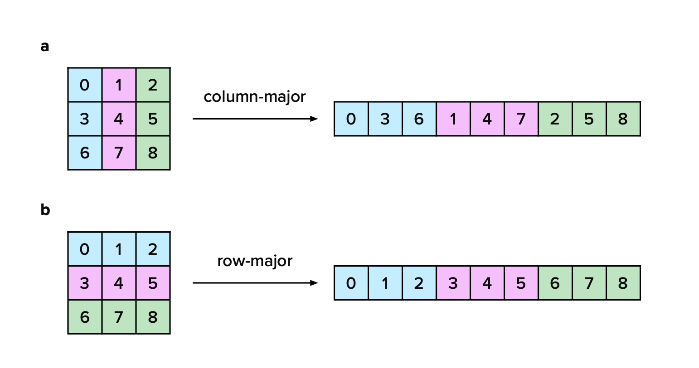
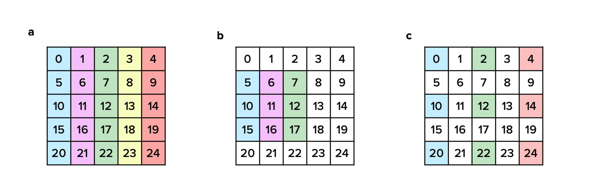

# LAPACK in your web browser: high-performance linear algebra with stdlib

Web applications are rapidly emerging as a new frontier for high-performance scientific computation and AI-enabled end-user experiences. Underpinning the ML/AI revolution is linear algebra, a branch of mathematics concerning linear equations and their representations in vectors spaces and via matrices. [LAPACK](https://netlib.org/lapack/) ("**L**inear **A**lgebra **Pack**age") is a fundamental software library for numerical linear algebra, providing robust, battle-tested implementations of common matrix operations. Despite LAPACK being a foundational component of most numerical computing programming languages and libraries, a comprehensive, high-quality LAPACK implementation tailored to the unique constraints of the web has yet to materialize. That is...until now.

Hi! I am [Pranav Goswami](https://github.com/pranavchiku), and, over the past summer, I worked with [Athan Reines](https://github.com/kgryte) to add initial LAPACK support to [stdlib](https://github.com/stdlib-js/stdlib), a fundamental library for scientific computation written in C and JavaScript and optimized for use in web browsers and other web-native environments, such as Node.js and Deno. In this blog post, I'll discuss my journey, some expected and unexpected (!) challenges, and the road ahead. My hope is that this work, with a little bit of luck, provides a critical building block in making web browsers a first-class environment for numerical computation and machine learning and portends a future of more powerful AI-enabled web applications.

Sound interesting? Let's go!

## What is stdlib?

Readers of this blog are likely Python enthusiasts and industry practitioners who are "in the know" regarding all things NumPy, SciPy, and PyTorch, but you may not be as intimately familiar with the wild world of web technologies. For those coming from the world of scientific Python, the easiest way to think of [stdlib](https://github.com/stdlib-js/stdlib) is as an open source scientific computing library in the mold of NumPy and SciPy providing multi-dimensional array data structures and associated routines for mathematics, statistics, and linear algebra, but which uses JavaScript, rather than Python, as its primary scripting language and is laser-focused on the web ecosystem and its application development paradigms. This focus necessitates some interesting design and project architecture decisions, which make stdlib rather unique when compared to more traditional libraries designed for numerical computation.

To take NumPy as an example, NumPy is a single monolithic library, where all of its components, outside of optional third-party dependencies such as OpenBLAS, form a single, indivisible unit. One cannot simply install NumPy routines for [array manipulation](https://numpy.org/doc/stable/reference/routines.array-manipulation.html) without installing all of NumPy. If you are deploying an application which only needs NumPy's `ndarray` object and a couple of its manipulation routines, installing and bundling all of NumPy means including a considerable amount of ["dead code"](https://en.wikipedia.org/wiki/Dead_code). In web development parlance, we'd say that NumPy is not ["tree shakeable"](https://en.wikipedia.org/wiki/Tree_shaking). For a normal NumPy installation, this implies at least 30MB of disk space, and at least [15MB of disk space](https://towardsdatascience.com/how-to-shrink-numpy-scipy-pandas-and-matplotlib-for-your-data-product-4ec8d7e86ee4) for a customized build which excludes all debug statements. For SciPy, those numbers can balloon to 130MB and 50MB, respectively. Needless to say, shipping a 15MB library in a web application for just a few functions is a non-starter, especially for developers needing to deploy web applications to devices with poor network connectivity or memory constraints.

Given the unique constraints of web application development, stdlib takes a bottom-up approach to its design, where every unit of functionality can be installed and consumed independent of unrelated and unused parts of the codebase. By embracing a decomposable software architecture and [radical modularity](https://aredridel.dinhe.net/2016/06/04/radical-modularity/), stdlib offers users the ability to install and use exactly what they need, with little-to-no excess code beyond a desired set of APIs and their explicit dependencies, thus ensuring smaller memory footprints, bundle sizes, and faster deployment.

As an example, suppose you are working with two stacks of matrices (i.e., two-dimensional slices of three-dimensional cubes), and you want to select every other slice and perform the common BLAS operation `y += a*x`, where `x` and `y` are [`ndarrays`](https://stdlib.io/docs/api/latest/@stdlib/ndarray/ctor) and `a` is a scalar constant. To do this with NumPy, you'd first install all of NumPy

```bash
pip install numpy
```

and then perform the various operations

```python
# Import all of NumPy:
import numpy as np

# Define arrays:
x = np.asarray(...)
y = np.asarray(...)

# Perform operation:
y[::2,:,:] += 5.0 * x[::2,:,:]
```

With stdlib, in addition to installing as a monolithic library, you can install the various units of functionality as separate packages

```bash
npm install @stdlib/ndarray-fancy @stdlib/blas-daxpy
```

and then perform the various operations

```javascript
// Individually import desired functionality:
import FancyArray from '@stdlib/ndarray-fancy';
import daxpy from '@stdlib/blas-daxpy';

// Define ndarray meta data:
const shape = [4, 4, 4];
const strides = [...];
const offset = 0;

// Define arrays using a "lower-level" fancy array constructor:
const x = new FancyArray('float64', [...], shape, strides, offset, 'row-major');
const y = new FancyArray('float64', [...], shape, strides, offset, 'row-major');

// Perform operation:
daxpy(5.0, x['::2,:,:'], y['::2,:,:']);
```

Importantly, not only can you independently install any one of stdlib's over [4,000 packages](https://github.com/stdlib-js), but you can also fix, improve, and remix any one of those packages by forking an associated GitHub repository (e.g., see [`@stdlib/ndarray-fancy`](https://github.com/stdlib-js/ndarray-fancy/tree/main)). And by defining explicit layers of abstraction and dependency trees, stdlib offers you the freedom to choose the right layer of abstraction for your application. In some ways, it's a simple—and, if you're accustomed to conventional scientific software library design, perhaps unorthodox—idea, but, when tightly integrated with the web platform, it has powerful consequences and creates exciting new possibilities!

## What about WebAssembly?

Okay, so maybe your interest has piqued; stdlib seems intriguing. But what does this have to do with LAPACK in web browsers? Well, the goal of my summer project was to apply the stdlib ethos—small, narrowly scoped packages which do one thing and do one thing well—in bringing LAPACK to the web.

But wait, you say! That is an extreme undertaking. LAPACK is vast, with approximately 1,700 routines, and implementing even 10% of them within a three-month time frame is a significant challenge. Wouldn't it be better to just compile LAPACK to [WebAssembly](https://webassembly.org), a portable compilation target for programming languages such as C, Go, and Rust, which enables deployment on the web, and call it a day?

Unfortunately, there are several issues with this approach.

1. Compiling Fortran to WebAssembly is still an area of active development (see [1](https://gws.phd/posts/fortran_wasm/), [2](https://pyodide.org/en/0.25.0/project/roadmap.html#find-a-better-way-to-compile-fortran), [3](https://github.com/scipy/scipy/issues/15290), [4](https://github.com/pyodide/pyodide/issues/184), and [5](https://lfortran.org/blog/2023/05/lfortran-breakthrough-now-building-legacy-and-modern-minpack/)). At the time of this post, a common approach is to use [`f2c`](https://netlib.org/f2c/) to compile Fortran to C and then to perform a separate compilation step to convert C to WebAssembly. However, this approach is problematic as `f2c` only fully supports Fortran 77, and the generated code requires extensive patching. Work is underway to develop an LLVM-based Fortran compiler, but gaps and complex toolchains remain.
1. As alluded to above in the discussion concerning monolithic libraries in web applications, the vastness of LAPACK is part of the problem. Even if the compilation problem is solved, including a single WebAssembly binary containing all of LAPACK in a web application needing to use only one or two LAPACK routines means considerable dead code, resulting in slower loading times and increased memory consumption.
1. While one could attempt to compile individual LAPACK routines to standalone WebAssembly binaries, doing so could result in binary bloat, as multiple standalone binaries may contain duplicated code from common dependencies. To mitigate binary bloat, one could attempt to perform module splitting. In this scenario, one first factors out common dependencies into a standalone binary containing shared code and then generates separate binaries for individual APIs. While suitable in some cases, this can quickly get unwieldy, as this approach requires linking individual WebAssembly modules at load-time by stitching together the exports of one or more modules with the imports of one or more other modules. Not only can this be tedious, but this approach also entails a performance penalty due to the fact that, when WebAssembly routines call imported exports, they now must cross over into JavaScript, rather than remaining within WebAssembly. Sound complex? It is!
1. Apart from WebAssembly modules operating exclusively on scalar input arguments (e.g., computing the sine of a single number), every WebAssembly module instance must be associated with WebAssembly memory, which is allocated in fixed increments of 64KiB (i.e., a "page"). And importantly, as of this blog post, WebAssembly memory can only grow and [never shrink](https://github.com/WebAssembly/memory-control/blob/16dd6b93ab82d0b4b252e3da5451e9b5e452ee62/proposals/memory-control/Overview.md). As there is currently no mechanism for releasing memory to a host, a WebAssembly application's memory footprint can only increase. These two aspects combined increase the likelihood of allocating memory which is never used and the prevalence of memory leaks.
1. Lastly, while powerful, WebAssembly entails a steeper learning curve and a more complex set of often rapidly evolving toolchains. In end-user applications, interfacing between JavaScript—a web-native dynamically-compiled programming language—and WebAssembly further brings increased complexity, especially when having to perform manual memory management.

To help illustrate the last point, let's return to the BLAS routine `daxpy`, which performs the operation `y = a*x + y` and where `x` and `y` are strided vectors and `a` a scalar constant. If implemented in C, a basic implementation might look like the following code snippet.

```c
void c_daxpy(const int N, const double alpha, const double *X, const int strideX, double *Y, const int strideY) {
	int ix;
	int iy;
	int i;
	if (N <= 0) {
		return;
	}
	if (alpha == 0.0) {
		return;
	}
	if (strideX < 0) {
		ix = (1-N) * strideX;
	} else {
		ix = 0;
	}
	if (strideY < 0) {
		iy = (1-N) * strideY;
	} else {
		iy = 0;
	}
	for (i = 0; i < N; i++) {
		Y[iy] += alpha * X[ix];
		ix += strideX;
		iy += strideY;
	}
	return;
}
````

After compilation to WebAssembly and loading the WebAssembly binary into our web application, we need perform a series of steps before we can call the `c_daxpy` routine from JavaScript. First, we need to instantiate a new WebAssembly module.

```javascript
const binary = new UintArray([...]);

const mod = new WebAssembly.Module(binary);
```

Next, we need to define module memory and create a new WebAssembly module instance.

```javascript
// Initialize 10 pages of memory and allow growth to 100 pages:
const mem = new WebAssembly.Memory({
	'initial': 10,  // 640KiB, where each page is 64KiB
	'maximum': 100  // 6.4MiB
});

// Create a new module instance:
const instance = new WebAssembly.Instance(mod, {
	'env': {
		'memory': mem
	}
});
```

After creating a module instance, we can now invoke the exported BLAS routine. However, if data is defined outside of module memory, we first need to copy that data to the memory instance and always do so in little-endian byte order.

```javascript
// External data:
const xdata = new Float64Array([...]);
const ydata = new Float64Array([...]);

// Specify a vector length:
const N = 5;

// Specify vector strides (in units of elements):
const strideX = 2;
const strideY = 4;

// Define pointers (i.e., byte offsets) for storing two vectors:
const xptr = 0;
const yptr = N * 8; // 8 bytes per double

// Create a DataView over module memory:
const view = new DataView(mem.buffer);

// Resolve the first indexed elements in both `xdata` and `ydata`:
let offsetX = 0;
if (strideX < 0) {
	offsetX = (1-N) * strideX;
}
let offsetY = 0;
if (strideY < 0) {
	offsetY = (1-N) * strideY;
}

// Write data to the memory instance:
for (let i = 0; i < N; i++) {
	view.setFloat64(xptr+(i*8), xdata[offsetX+(i*strideX)], true);
	view.setFloat64(yptr+(i*8), ydata[offsetY+(i*strideY)], true);
}
```

Now that data is written to module memory, we can call the `c_daxpy` routine.

```javascript
instance.exports.c_daxpy(N, 5.0, xptr, 1, yptr, 1);
```

And, finally, if we need to pass the results to a downstream library without support for WebAssembly memory "pointers" (i.e., byte offsets), such as D3, for visualization or further analysis, we need to copy data from module memory back to the original output array.

```javascript
for (let i = 0; i < N; i++) {
	ydata[offsetY+(i*strideY)] = view.getFloat64(yptr+(i*8), true);
}
```

That's a lot of work just to compute `y = a*x + y`. In contrast, compare to a plain JavaScript implementation, which might look like the following code snippet.

```javascript
function daxpy(N, alpha, X, strideX, Y, strideY) {
	let ix;
	let iy;
	let i;
	if (N <= 0) {
		return;
	}
	if (alpha == 0.0) {
		return;
	}
	if (strideX < 0) {
		ix = (1-N) * strideX;
	} else {
		ix = 0;
	}
	if (strideY < 0) {
		iy = (1-N) * strideY;
	} else {
		iy = 0;
	}
	for (i = 0; i < N; i++) {
		Y[iy] += alpha * X[ix];
		ix += strideX;
		iy += strideY;
	}
	return;
}
```

With the JavaScript implementation, we can then directly call `daxpy` with our externally defined data without the data movement required in the WebAssembly example above.

```javascript
daxpy(N, 5.0, xdata, 1, ydata, 1);
```

At least in this case, not only is the WebAssembly approach less ergonomic, but, as might be expected given the required data movement, there's a negative performance impact, as well, as demonstrated in the following figure.

<!-- TODO: remove the following Markdown image and keep the <figure> prior to publishing. The Markdown image is just for local development. -->


<figure style="text-align:center">
	
	<figcaption>
		Figure 1: Performance comparison of stdlib's C, JavaScript, and WebAssembly (Wasm) implementations for the BLAS routine <i>daxpy</i> for increasing array lengths (x-axis). In the <i>Wasm (copy)</i> benchmark, input and output data is copied to and from Wasm memory, leading to poorer performance.
	</figcaption>
</figure>

In the figure above, I'm displaying a performance comparison of stdlib's C, JavaScript, and WebAssembly (Wasm) implementations for the BLAS routine `daxpy` for increasing array lengths, as enumerated along the x-axis. The y-axis shows a normalized rate relative to a baseline C implementation. In the `Wasm` benchmark, input and output data is allocated and manipulated directly in WebAssembly module memory, and, in the `Wasm (copy)` benchmark, input and output data is copied to and from WebAssembly module memory, as discussed above. From the chart, we may observe the following:

1. In general, thanks to highly optimized just-in-time (JIT) compilers, JavaScript code, when carefully written, can execute only 2-to-3 times slower than native code. This result is impressive for a loosely typed, dynamically compiled programming language and, at least for `daxpy`, remains consistent across varying array lengths.
1. As data sizes and thus the amount of time spent in a WebAssembly module increase, WebAssembly can approach near-native (~1.5x) speed. This result aligns more generally with expected WebAssembly performance.
1. While WebAssembly can achieve near-native speed, data movement requirements may adversely affect performance, as observed for `daxpy`. In such cases, a well-crafted JavaScript implementation which avoids such requirements can achieve equal, if not better, performance, as is the case for `daxpy`. 

Overall, WebAssembly can offer performance improvements; however, the technology is not a silver bullet and needs to be used carefully in order to realize desired gains. And even when offering superior performance, such gains must be balanced against the costs of increased complexity, potentially larger bundle sizes, and more complex toolchains. For many applications, a plain JavaScript implementation will do just fine.

## Radical modularity

Now that I've prosecuted the case against just compiling the entirety of LAPACK to WebAssembly and calling it a day, where does that leave us? Well, if we're going to embrace the stdlib ethos, it leaves us in need of radical modularity.

To embrace radical modularity is to recognize that what is best is highly contextual, and, depending on the needs and constraints of user applications, developers need the flexibility to pick the right abstraction. If a developer is writing a Node.js application, that may mean binding to hardware-optimized libraries, such as OpenBLAS, Intel MKL, or Apple Accelerate in order to achieve superior performance. If a developer is deploying a web application needing a small set of numerical routines, JavaScript is likely the right tool for the job. And if a developer is working on a large, resource intensive WebAssembly application (e.g., for image editing or a gaming engine), then being able to easily compile individual routines as part of the larger application will be paramount. In short, we want a radically modular LAPACK.

My mission during the Quansight internship was to lay the groundwork for such an endeavor, to work out the kinks and find the gaps, and to hopefully get us a few steps closer to high-performance linear algebra on the web. But what does radically modularity look like? It all begins with the fundamental unit of functionality, the **package**.

Every package in stdlib is its own standalone thing, containing co-localized tests, benchmarks, examples, documentation, build files, and associated meta data (including the enumeration of any dependencies) and defining a clear API surface with the outside world. In order to add LAPACK support to stdlib, that means creating a separate standalone package for each LAPACK routine with the following structure:

```
├── benchmark
│   ├── c
│   │   ├── Makefile
│   │   └── benchmark.c
│   ├── fortran
│   │   ├── Makefile
│   │   └── benchmark.f
│   └── benchmark*.js
├── docs
│   ├── types
│   │   ├── index.d.ts
│   │   └── test.ts
│   └── repl.txt
├── examples
│   ├── c
│   │   ├── Makefile
│   │   └── example.c
│   └── index.js
├── include/*
├── lib
│   ├── index.js
│   └── *.js
├── src
│   ├── Makefile
│   ├── addon.c
│   ├── *.c
│   └── *.f
├── test
│   └── test*.js
├── binding.gyp
├── include.gypi
├── manifest.json
├── package.json
└── README.md
```

Briefly,

- **benchmark**: a folder containing micro-benchmarks to assess performance relative to a reference implementation (i.e., reference LAPACK).
- **docs**: a folder containing auxiliary documentation including REPL help text and TypeScript declarations defining typed API signatures.
- **examples**: a folder containing executable demonstration code, which, in addition to serving as documentation, helps developers sanity check implementation behavior.
- **include**: a folder containing C header files.
- **lib**: a folder containing JavaScript source implementations, with `index.js` serving as the package entry point and other `*.js` files defining internal implementation modules.
- **src**: a folder containing C and Fortran source implementations. Each modular LAPACK package should contain a slightly modified Fortran reference implementation (F77 to free-form Fortran). C files include a plain C implementation which follows the Fortran reference implementation, a wrapper for calling the Fortran reference implementation, a wrapper for calling hardware-optimized libraries (e.g., OpenBLAS) in server-side applications, and a native binding for calling into compiled C from JavaScript in Node.js or a compatible server-side JavaScript runtime.
- **test**: a folder containing unit tests for testing expected behavior in both JavaScript and native implementations. Tests for native implementations are written in JavaScript and leverage the native binding for interoperation between JavaScript and C/Fortran.
- **binding.gyp/include.gypi**: build files for compiling Node.js native add-ons, which provide a bridge between JavaScript and native code.
- **manifest.json**: a configuration file for stdlib's internal C and Fortran compiled source file package management.
- **package.json**: a file containing package meta data, including the enumeration of external package dependencies and a path to a plain JavaScript implementation for use in browser-based web applications.
- **README.md**: a file containing a package's primary documentation, which includes API signatures and examples for both JavaScript and C interfaces.

Given stdlib's demanding documentation and testing requirements, adding support for each routine is a decent amount of work, but the end result is robust, high-quality, and, most importantly, modular code suitable for serving as the foundation for scientific computation on the modern web. But enough with the preliminaries! Let's get down to business!

## A multi-phase approach

Building on previous efforts which added BLAS support to stdlib, we decided to follow a similar multi-phase approach when adding LAPACK support in which we first prioritize JavaScript implementations and their associated testing and documentation and then, once tests and documentation are present, back fill C and Fortran implementations and any associated native bindings to hardware-optimized libraries. This approach allows us to put some early points on the board, so to speak, quickly getting APIs in front of users, establishing robust test procedures and benchmarks, and investigating potential avenues for tooling and automation before diving into the weeds of build toolchains and performance optimizations. But where to even begin?

To determine which LAPACK routines to target first, I parsed LAPACK's Fortran source code to generate a call graph. This allowed me to infer the dependency tree for each LAPACK routine. With the graph in hand, I then performed a topological sort, thus helping me identify routines without dependencies and which will inevitably be building blocks for other routines. While a depth-first approach in which I picked a particular high-level routine and worked backward would enable me to land a specific feature, such an approach might cause me to get bogged down trying to implement routines of increasing complexity. By focusing on the "leaves" of the graph, I could prioritize commonly used routines (i.e., routines with high _indegrees_) and thus maximize my impact by unlocking the ability to deliver multiple higher-level routines either later in my internship or by other contributors.

With my plan in hand, I was excited to get to work. For my first routine, I chose [`dlaswp`](https://www.netlib.org/lapack/explore-html/d1/d7e/group__laswp_ga5d3ea3e3cb61e32750bf062a2446aa33.html#ga5d3ea3e3cb61e32750bf062a2446aa33), which performs a series of row interchanges on a general rectangular matrix according to a provided list of pivot indices and which is a key building block for LAPACK's LU decomposition routines. And that is when my challenges began...

## Challenges

### Legacy Fortran

Prior to my internship, I was (and still am!) a regular contributor to [LFortran](https://lfortran.org), a modern interactive Fortran compiler built on top of LLVM, and I was feeling fairly confident in my Fortran skills. However, one of my first challenges was simply understanding legacy Fortran code. Let's illustrate this with an example.

TODO(Pranav): clean up the following examples, as several don't make sense. This entire section from here onward needs a complete rewrite.

Consider a function `add` that takes two arguments: `N`, representing the size of the array, and an array `A`, which returns the sum of its elements. Please find the code snippet below.

FIXME: the text says two arguments, but the code snippet shows three arguments. `num` is declared but never used. It is not clear why we are using a nested loop. Without seeing the `add` implementation, this program is inscrutable.

```fortran
integer function add( M, N, A ) result(r)
    ! logic to compute sum of elements
end function

program main
    integer :: i, j, num, A( 4, 3 )
    integer :: res( 4 )
    do i = 1, 4
        do j = 1, 3
            ! num = compute elements to pass
            res( i ) = add( M, N, A( i, j ) )
        end do
    end do
end program
```

At first glance, it appears that the code is passing the `(i, j)th` element of `A` to `add`, making it seem incorrect. However, merely examining the code doesn't reveal whether `A(i, j:)`, `A(i:, j)`, `A(i:, j:)`, or a single array item is being referenced. In Fortran, `A(i, j)` represents a pointer to that location, allowing any of these combinations to be possible. This legacy behavior in Fortran is challenging to interpret and complicates translation to JavaScript. There’s an [active discussion](https://fortran-lang.discourse.group/t/matrix-index-pointer-confusion/8453) on Fortran-lang discourse addressing this issue. Similar legacy practices in Fortran further add to the complexity of converting code accurately to JavaScript.

More specifically, let us examine two additional implementations of the add function in Fortran, where the function computes the sum of elements across a row and a column.

- `add` function to compute sum of elements over a row

```fortran
integer function add( N, A ) result(r)
  integer, intent(in) :: N
  integer, dimension( N ), intent(in) :: A
  integer :: i
  r = 0
  do i = 1, N
      r = r + A( i )
  end do
end function
```

- `add` function to compute sum of elements over a column

FIXME: this function definition is effectively indistinguishable from the previous function definition. It is just a copy-paste and replace `N` with `M`. If there is a difference, for the lay Python reader, the difference is entirely not obvious.

```fortran
integer function add( M, A ) result(r)
  integer, intent(in) :: M
  integer, dimension( M ), intent(in) :: A
  integer :: i
  r = 0
  do i = 1, M
      r = r + A( i )
  end do
end function
```

If we attempt to convert these functions to JavaScript while assuming a column-major order, it is crucial to ensure that the logic is accurately translated to prevent any inconsistencies.


The definition of the add function will include two additional arguments: offsetA and strideA.

FIXME: why does the offset come before the stride? This is not stdlib convention.

```javascript
function add( M, N, A, offsetA, strideA );
```

- JS translation of program considering `add` function to compute sum of elements over a row

FIXME: this "translation" is incorrect. Again, the `add` function is shown to have 5 arguments, but you only call with 4 arguments. The matrix has 12 elements but you call `add` 12 times. `num` is declared but never used. Etc. Etc. 

```javascript
function main() {
  let i;
  let j;
  let num;
  let A;
  let res;
  A = new Float64Array(4 * 3);
  res = new Float64Array(4);
  for (i = 0; i < 4; i++) {
    for (j = 0; j < 3; j++) {
      // num = compute elements to pass
      res[i] = add(3, A, offsetA + i * 4, 3);
    }
  }
}
```

- JS translation of program considering `add` function to compute sum of elements over a column

FIXME: this "translation" is incorrect.

```javascript
function main() {
  let i;
  let j;
  let num;
  let A;
  let res;
  A = new Float64Array(4 * 3);
  res = new Float64Array(4);
  for (i = 0; i < 4; i++) {
    for (j = 0; j < 3; j++) {
      // num = compute elements to pass
      res[i] = add(4, A, offsetA + i * 3, 1);
    }
  }
}
```

Thereby, understanding legacy Fortran code is crucial to accurately translating it to JavaScript, ensuring that the logic is correctly implemented to avoid discrepancies.

TODO(Pranav): this is the end of the section which needs updating. This comment can be removed once updated.

### Test Coverage

One of the problems with pursuing a bottom-up approach to adding LAPACK support is that explicit unit tests for lower-level utility routines are often non-existent in LAPACK. LAPACK's test suite largely employs a hierarchical testing philosophy in which testing higher-level routines is assumed to ensure that their dependent lower-level routines are functioning correctly as part of an overall workflow. While one can argue that focusing on integration testing over unit testing for lower-level routines is reasonable, as adding tests for every routine could potentially increase the maintenance burden and complexity of LAPACK's testing framework, it means that we couldn't readily rely on prior art for unit testing and would have to come up with comprehensive standalone unit tests for each lower-level routine on our own.

### Documentation

Along a similar vein to test coverage, outside of LAPACK itself, finding real-world documented examples showcasing the use of lower-level routines was challenging. While LAPACK routines are consistently preceded by a documentation comment providing descriptions of input arguments and possible return values, without code examples, visualizing and grokking expected input and output values can be challenging, especially when dealing with specialized matrices. And while neither the absence of unit tests nor documented examples is the end of the world, it meant that adding LAPACK support to stdlib would be more of a slog than I expected. Writing benchmarks, tests, examples, and documentation was simply going to require more time and effort, potentially limiting the number of routines I could implement.

### Memory layout orders

When storing matrix elements in linear memory, one has two choices: either store columns contiguously or rows contiguously (see Figure 2). The former memory layout is referred to as **column-major** order and the latter as **row-major** order.

<!-- TODO: remove the following Markdown image and keep the <figure> prior to publishing. The Markdown image is just for local development. -->



<figure style="text-align:center">
	
	<figcaption>
		Figure 2: Schematic demonstrating storing matrix elements in linear memory in either (a) column-major (Fortran-style) or (b) row-major (C-style) order. The choice of which layout to use is largely a matter of convention.
	</figcaption>
</figure>

The choice of which layout to use is largely a matter of convention. For example, Fortran stores elements in column-major order, and C stores elements in row-major order. Higher-level libraries, such as NumPy and stdlib, support both column- and row-major orders, allowing you to configure the layout of a multi-dimensional array during array creation.

```javascript
import asarray from '@stdlib/ndarray-array';

// Create a row-major array:
const x = asarray([1.0, 2.0, 3.0, 4.0], {
	'shape': [2, 2],
	'order': 'row-major'
});

// Create a column-major array:
const y = asarray([1.0, 3.0, 2.0, 4.0], {
	'shape': [2, 2],
	'order': 'column-major'
});
```

While neither memory layout is inherently better than the other, arranging data to ensure sequential access in accordance with the conventions of the underlying storage model is critical in ensuring optimal performance. Modern CPUs are able to process sequential data more efficiently than non-sequential data, which is primarily due to CPU caching which, in turn, exploits spatial locality of reference.

To demonstrate the performance impact of sequential vs non-sequential element access, consider the following function which copies all the elements from an `MxN` matrix `A` to another `MxN` matrix `B` and which does so assuming that matrix elements are stored in column-major order.

```javascript
/**
* Copies elements from `A` to `B`.
*
* @param {integer} M - number of rows
* @param {integer} N - number of columns
* @param {Array} A - source matrix
* @param {integer} strideA1 - index increment to move to the next element in a column
* @param {integer} strideA2 - index increment to move to the next element in a row
* @param {integer} offsetA - index of the first indexed element in `A`
* @param {Array} B - source matrix
* @param {integer} strideB1 - index increment to move to the next element in a column
* @param {integer} strideB2 - index increment to move to the next element in a row
* @param {integer} offsetB - index of the first indexed element in `B`
*/
function copy(M, N, A, strideA1, strideA2, offsetA, B, strideB1, strideB2, offsetB) {
	// Initialize loop bounds:
	const S0 = M;
	const S1 = N;

	// For column-major matrices, the first dimension has the fastest changing index.
	// Compute "pointer" increments accordingly:
	const da0 = strideA1;                  // pointer increment for innermost loop
	const da1 = strideA2 - (S0*strideA1);  // pointer increment for outermost loop
	const db0 = strideB1;
	const db1 = strideB2 - (S0*strideB1);

	// Initialize "pointers" to the first indexed elements in the respective arrays:
	let ia = offsetA;
	let ib = offsetB;

	// Iterate over matrix dimensions:
	for (let i1 = 0; i1 < S1; i1++) {
		for (let i0 = 0; i0 < S0; i0++) {
			B[ib] = A[ia];
			ia += da0;
			ib += db0;
		}
		ia += da1;
		ib += db1;
	}
}
```

Let `A` and `B` be the following `3x2` matrices:

$$
A = \begin{bmatrix}
1 & 2 \\
3 & 4 \\
5 & 6
\end{bmatrix},
\ B = \begin{bmatrix}
0 & 0 \\
0 & 0 \\
0 & 0
\end{bmatrix}
$$

When both `A` and `B` are stored in column-major order, we can call the `copy` routine as follows:

```javascript
const A = [1, 3, 5, 2, 4, 6];
const B = [0, 0, 0, 0, 0, 0];

copy(3, 2, A, 1, 3, 0, B, 1, 3, 0);
```

If, however, `A` and `B` are both stored in row-major order, the call signature changes to

```javascript
const A = [1, 2, 3, 4, 5, 6];
const B = [0, 0, 0, 0, 0, 0];

copy(3, 2, A, 2, 1, 0, B, 2, 1, 0);
```

Notice that, in the latter scenario, we fail to access elements in sequential order within the innermost loop, as `da0` is `2` and `da1` is `-5` and similarly for `db0` and `db1`. Instead, the array index "pointers" repeatedly skip ahead before returning to earlier elements in linear memory, with `ia = {0, 2, 4, 1, 3, 5}` and `ib` the same. In Figure 3, we show the performance impact of non-sequential access.

TODO: insert chart

<!-- TODO: remove the following Markdown image and keep the <figure> prior to publishing. The Markdown image is just for local development. -->


<figure style="text-align:center">
	
	<figcaption>
		Figure 3: TODO: add caption
	</figcaption>
</figure>

TODO: describe results.

Being written in Fortran, LAPACK assumes column-major access order and implements its algorithms accordingly. This presents issues for libraries, such as stdlib, which not only support row-major order, but make it their default memory layout. Were we to simply port LAPACK's Fortran implementations to JavaScript, users providing row-major matrices would experience adverse performance impacts stemming from non-sequential access.

To mitigate adverse performance impacts, we borrowed an idea from [BLIS](https://github.com/flame/blis), a BLAS-like library supporting both row- and column-major memory layouts in BLAS routines, and decided to modify LAPACK implementations when porting routines from Fortran to JavaScript and C to explicitly accommodate both column- and row-major memory layouts. For some implementations, such as `dlacpy`, which is similar to the `copy` function defined above, the modifications are straightforward, often involving stride tricks and loop interchange, but, for others, they turned out to be much less straightforward due to specialized matrix handling, varying access patterns, and combinatorial parameterization.

### ndarrays

LAPACK routines primarily operate on matrices stored in linear memory and whose elements are accessed according to specified dimensions and the stride of the leading (i.e., first) dimension. Dimensions specify the number of elements in each row and column, respectively. The stride specifies how many elements in linear memory must be skipped in order to access the first element of the next row from the first element of the previous row. LAPACK assumes that elements belonging to the same column are always contiguous (i.e., adjacent in linear memory). Figure TODO provides a visual representation of LAPACK conventions (specifically, schematics (a) and (b)).

<!-- TODO: remove the following Markdown image and keep the <figure> prior to publishing. The Markdown image is just for local development. -->



<figure style="text-align:center">
	
	<figcaption>
		Figure TODO: a) A 5-by-5 contiguous matrix stored in column-major order. b) A 3-by-3 non-contiguous sub-matrix stored in column-major order. Sub-matrices can be operated on in LAPACK by providing a pointer to the first indexed element and specifying the stride of the leading (i.e., first) dimension. In this case, the stride of leading dimension is five, even though there are only three elements per column, due to the non-contiguity of sub-matrix elements in linear memory when stored as part of a larger matrix. In LAPACK, the stride of the trailing (i.e., second) dimension is always assumed to be unity. c) A 3-by-3 non-contiguous sub-matrix stored in column-major order having non-unit strides and generalizing LAPACK stride conventions to both leading and trailing dimensions. This generalization underpins stdlib's multi-dimensional arrays (also referred to as "ndarrays").
	</figcaption>
</figure>

Libraries, such as NumPy and stdlib, generalize LAPACK's strided array conventions to support

1. non-unit strides in the last dimension (see Figure TODO (c)).
2. negative strides for any dimension. LAPACK requires that the stride of the leading dimension be positive.
3. multi-dimensional arrays having more than two dimensions.

Support for non-unit strides in the last dimension ensures support for O(1) creation of non-contiguous views of linear memory without requiring explicit data movement. This views are often called "slices". As an example, consider the following code snippet which creates such views using APIs provided by stdlib.

```javascript
import linspace from '@stdlib/array-linspace'
import FancyArray from '@stdlib/ndarray-fancy';

// Define the two-dimensional array shown in Figure TODO (a):
const x = new FancyArray('float64', linspace(0, 24, 25), [5, 5], [5, 1], 0, 'row-major');
// returns <FancyArray>

// Create a sub-matrix view shown in Figure TODO (b):
const v1 = x['1:4,:3'];
// returns <FancyArray>

// Create a sub-matrix view shown in Figure TODO (c):
const v2 = x['1:4,::2'];
// returns <FancyArray>

// Assert that all arrays share the same underlying memory buffer:
const b1 = ( v1.data.buffer === x.data.buffer );
// returns true

const b2 = ( v2.data.buffer === x.data.buffer );
// returns true
```

Without support for non-unit strides in the last dimension, returning a view from the expression `x['1:4,::2']` would not be possible, as one would need to copy selected elements to a new memory buffer in order to ensure contiguity.

Support for negative strides enables O(1) reversal and rotation of elements along one or more dimensions (see Figure TODO). For example, to flip a matrix top-to-bottom and left-to-right, one need only negate the strides. Building on the previous code snippet, the following code snippet demonstrates flipping elements about one or more axes.

```javascript
import linspace from '@stdlib/array-linspace'
import FancyArray from '@stdlib/ndarray-fancy';

// Define the two-dimensional array shown in Figure TODO (a):
const x = new FancyArray('float64', linspace(0, 24, 25), [5, 5], [5, 1], 0, 'row-major');

// Reverse elements along each row as shown in Figure TODO (b):
const v1 = x['::-1,:'];

// Reverse elements along each column as shown in in Figure TODO (c):
const v2 = x[':,::-1'];

// Reverse elements along both columns and rows as shown in in Figure TODO (d):
const v3 = x['::-1,::-1'];

// Assert that all arrays share the same underlying memory buffer:
const b1 = ( v1.data.buffer === x.data.buffer );
// returns true

const b2 = ( v2.data.buffer === x.data.buffer );
// returns true

const b3 = ( v3.data.buffer === x.data.buffer );
// returns true
```

<!-- TODO: remove the following Markdown image and keep the <figure> prior to publishing. The Markdown image is just for local development. -->


<figure style="text-align:center">
	
	<figcaption>
		Figure TODO: a) Given a 3-by-3 matrix stored in column-major order, one can manipulate the strides of the leading and trailing dimensions to create views in which matrix elements along one or more axes are accessed in reverse order. b) Using similar stride manipulation, one can create views in which matrix elements are rotated relative storage order.
	</figcaption>
</figure>

TODO: scope creep and increasing ambition.

Previewed in the discussion of memory layouts, need an offset parameter. LAPACK assumes that matrix data is stored in a single block of memory and only allows specifying the stride of the leading dimension of a matrix. While this allows operating on sub-matrices, it does not allow supporting matrices stored in non-contiguous memory. For non-contiguous multi-dimensional data, libraries, such as NumPy, must copy matrices to temporary buffers in order to ensure contiguous memory before calling into LAPACK. This additional data movement is not ideal, and so we sought to generalize BLIS-style APIs by including offset parameters. As JavaScript does not have an explicit concept of memory addresses and thus pointers in the manner of C, support for offset parameters allows us to avoid temporary typed array view creation by simply specifying the index of the first indexed element.

TODO: shift the computation of the index of the first element to user land, rather than the implementation. For ndarrays, this is part of the ndarray meta data. Show refactor of `daxpy` without the `ix` and `iy` initial logic. Furthermore, allow generalization to arbitrary access order (LAPACK often assumes stride of second dimension is positive 1).


For packages that accept arrays as arguments, we developed a foundational, private version from which two distinct APIs are derived: one for the standard API and another for the ndarray API, both of which are available to end users. The final design was achieved through multiple iterations. The initial design included an `order` parameter, an array argument `A`, and `LDA`, which stands for the leading dimension of the array. Traditional BLAS APIs assume a contiguous row and column order. The `ndarray` APIs make no assumptions, as shown in figure ndarray 1(A) below, allowing users the flexibility to define views over buffers in any desired manner. Consequently, we transitioned to a new design that accepts the order, the array argument `A`, `strideA1` (the stride of the first dimension of `A`), `strideA2` (the stride of the second dimension of `A`), and a final `offsetA` parameter, which serves as an index offset for `A`. In the final iteration, the `order` parameter was removed from the base implementation, as it can be easily inferred from the two stride values.

Let's now understand `ndarray` API using an example of LAPACK routine `dlacpy` that copies a matrix `A` to a matrix `B`. The function definition looks like:

```javascript
function dlacpy( M, N, A, strideA1, strideA2, offsetA, B, strideB1, strideB2, offsetB );
```


Suppose you want to copy the matrix A to B using the ndarray API, as illustrated in the graphic above. This operation is not feasible with conventional LAPACK/BLAS APIs, but you can easily achieve it by running the dlacpy function with the following arguments:

```javascript
B = dlacpy(5, 4, A, 8, 2, 1, B, 10, 2, 5);
```

Not only just this, you may also support accessing elements in reverse order like:

```javascript
B = dlacpy(5, 4, A, 8, 2, 1, B, -10, -2, B.length - 6);
```

Additionally, you can also support accessing elements in reverse order, such as:

```javascript
/*
[ 999, 999, 999, 999, 999 ]
[  20, 999,  18, 999,  12 ]
[ 999, 999, 999, 999, 999 ]
[  10, 999,   4, 999,   2 ]
[ 999, 999, 999, 999, 999 ]
*/
```

## Current status and next steps

Despite the challenges, unforeseen setbacks, and multiple design iterations, I am happy to report that I was able to open [36 PRs](https://github.com/stdlib-js/stdlib/pulls?q=sort%3Aupdated-desc+is%3Apr+author%3APranavchiku+label%3ALAPACK+) adding support for various LAPACK routines and associated utilities, and I co-authored a blog post with [Athan Reines](https://github.com/kgryte) on ["How to Call Fortran Routines from JavaScript Using Node.js"](https://blog.stdlib.io/how-to-call-fortran-routines-from-javascript-with-node-js/). Obviously not quite 1,700 routines, but a good start! :)

Nevertheless, the future is bright, and we are quite excited about this work. There's still plenty of room for improvement and additional research and development. In particular, we're keen to

1. explore tooling and automation.
2. address build issues when resolving the source files of Fortran dependencies spread across multiple stdlib packages.
3. roll out C and Fortran implementations and native bindings for stdlib's existing LAPACK packages.
4. continue growing stdlib's library of modular LAPACK routines.
5. identify additional areas for performance optimization.

While the internship has ended, my plan is to continue adding packages and pushing this effort along. Given the immense potential and LAPACK's fundamental importance, we'd love to see this initiative of bringing LAPACK to the web continue to grow, so, if you are interested in helping out and even sponsoring development, please don't hesitate to reach out! The folks at Quansight would be more than happy to chat.

## Acknowledgments

And with that, I would like to thank Quansight and [Athan Reines](https://github.com/kgryte) for providing me with this opportunity. I feel incredibly fortunate to have learned so much. Being an intern at Quansight was long a dream of mine, and I am very grateful to have fulfilled it. I want to extend a special thanks to [Melissa Mendonça](https://github.com/melissawm), who is an amazing mentor and all around wonderful person; thank you for investing so much time in us! And thank you to everyone else at Quansight for helping me out in ways both big and small along the way.

Cheers!